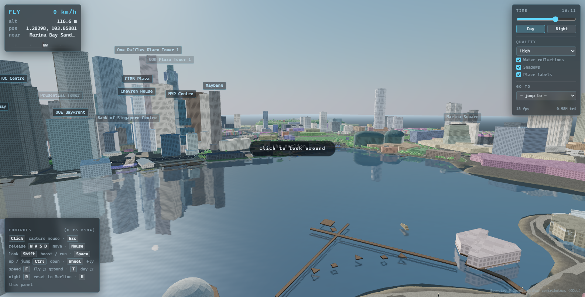
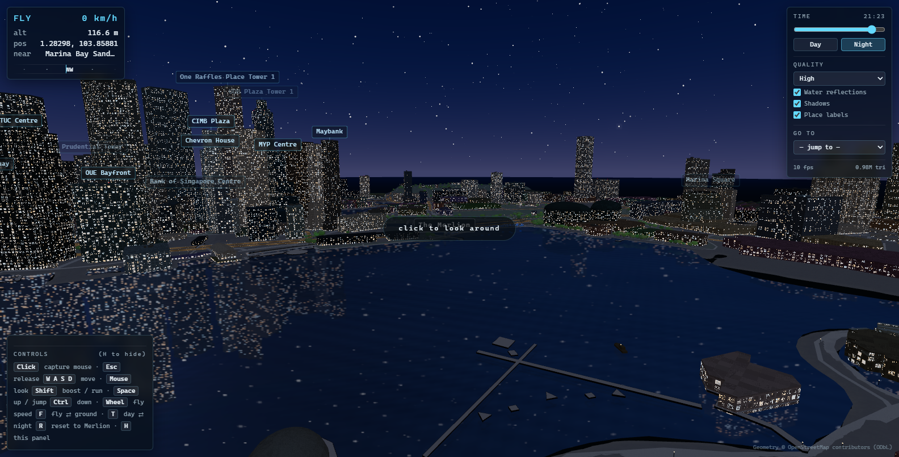
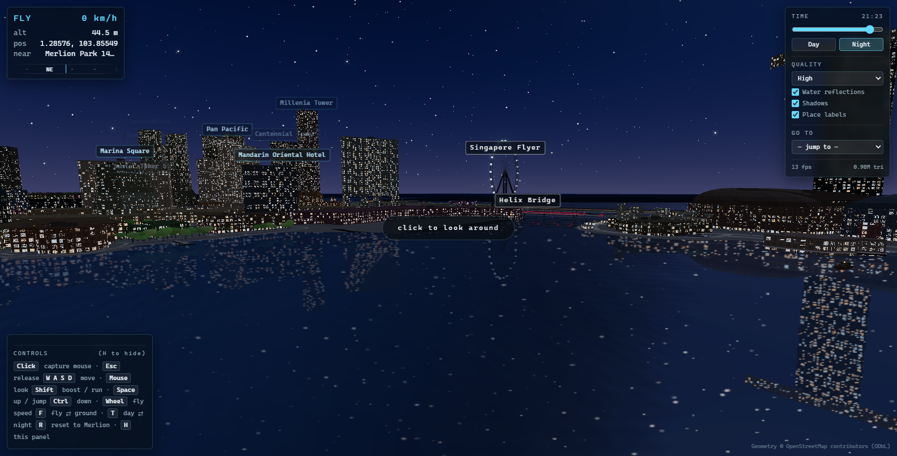

# Singapore — 4 km² around the Merlion

**▶ [Explore it live](https://amitgangrade.github.io/singapore-3d/)** — click the
canvas to capture the mouse, **F** to switch between flying and walking, **T** for
day/night.

An explorable 3D model of central Singapore. Two kilometres square, centred on the
Merlion, built from real OpenStreetMap geometry: every building footprint and
height, every road, bridge, park, river and quay is the real one. You can fly
over it, walk it, or run it, and switch between day and night at any point on a
24-hour clock.





## Running it

```bash
npm install
```

```bash
npm run dev
```

Then open the URL Vite prints. Click the canvas to capture the mouse.

## Controls

| | |
|---|---|
| **Click** / **Esc** | capture / release the mouse |
| **W A S D** | move — in the air you fly where you look |
| **Mouse** | look |
| **Shift** | run (on foot) / boost (flying) |
| **Space** | ascend / jump |
| **Ctrl** | descend |
| **Wheel** | fly speed |
| **F** | switch between flying and on foot |
| **T** | switch between day and night |
| **R** | back to the opening view |
| **H** | show or hide the controls panel |

The panel on the right has a continuous time-of-day slider, a quality preset,
toggles for water reflections / shadows / place labels, and a **Go to** list that
jumps to the Merlion, Marina Bay Sands, Gardens by the Bay, Raffles Place, the
Esplanade, the Singapore Flyer, the Helix Bridge, Boat Quay, Clarke Quay and Fort
Canning Hill.

## What is in the model

Everything below is real OSM data for the 2 km × 2 km box
(1.27786–1.29582 N, 103.84561–103.86357 E):

- **1,426 buildings and 592 building parts.** 1,118 carry a surveyed height, the
  rest are derived from `building:levels`. Facades are grouped into material
  families (glass, metal, concrete, plaster, stone, brick) taken from
  `building:material` where OSM has it. Roof shapes — domes, pyramids, gables —
  are modelled where tagged, which is what gives the Esplanade its two shells.
- **3,483 ways** — motorway through footpath, with widths from `lanes` and
  `width`, lane markings painted at their real physical size, and **114 bridges**
  on smoothed decks with parapets and pylons.
- **Marina Reservoir (1.81 km²), the Singapore River, Dragonfly Lake** and 28
  smaller ponds, fountains and pools.
- **141 parks, gardens, lawns and pitches**, including the Padang, Esplanade
  Park, Fort Canning, Hong Lim Park and Gardens by the Bay.
- **408 mapped street trees**, plus park planting scattered at a per-class
  density, in two silhouettes (broadleaf and palm).
- **1,297 named places** — hotels, offices, museums, attractions — used for the
  place labels and the "nearest" readout.
- Moving traffic on the real carriageways (driving on the left, in lane, over the
  bridge decks) and bumboats working loops on the bay.

Four things OSM does not describe well enough to extrude are modelled by hand:
**the Merlion** (OSM has the park and a POI node, no statue), **the Supertrees**
(only the outline of Supertree Grove), **the Helix Bridge** (a plain bridge way,
losing the double helix), and **the Singapore Flyer** (a few blocky parts,
replaced with an actual wheel that turns once every 30 minutes). Everything else
— the Marina Bay Sands towers and SkyPark, the ArtScience Museum, the Esplanade
domes, the whole CBD — is OSM geometry.

## Notes on how it works

A few decisions worth knowing about if you change things:

- **The sun follows a real solar path for latitude 1.29 N.** That is why the
  light climbs almost vertically at midday and why dusk is short. The "Day"
  preset is mid-afternoon, not noon, because at noon the sun here is within ten
  degrees of vertical and the city has no shadows and no modelling at all.
- **The daytime sky needs its output scaled down, not its rayleigh turned up.**
  The atmosphere model returns radiance well above 1.0 and ACES tone mapping
  compresses all of that to white, so no amount of scattering tuning produces a
  blue sky — only a brighter white one. Bringing the output back into the tone
  mapper's colourful range is what makes it read blue.
- **The night sky is a gradient dome laid over the atmosphere model.** With the
  sun 50 degrees below the horizon there is nothing left to scatter and the
  model renders near-black, which is accurate but not what a clear tropical
  night looks like from a lit city.
- **Building colour is saturated by inverse height.** Singapore's low-rise
  really is colourful — the shophouse rows of Chinatown, Kampong Glam and Boat
  Quay are painted in pastels — while the towers are tinted glass and steel. One
  saturation for everything gives either a drab city or a cartoon one.
- **Only water crossings are lit in colour.** OSM tags every road-over-road
  flyover as a `bridge` too, and the Marina Coastal interchange alone has dozens
  of them; lighting those buries the skyline in neon lines.
- **Night windows are procedural, not textured.** Building facade UVs are
  metric — `u` counts window modules around the perimeter, `v` counts storeys —
  so the shader can light a plausible fraction of a plausible grid of windows on
  every building. Ground floors light up more, as shopfronts.
- **Indirect light is kept deliberately low.** The equatorial sky is very bright,
  and at full strength the hemisphere and environment terms flatten the cast
  shadows to invisibility.
- **Water is a real mirror pass** (three's `Water`), so Marina Bay Sands and the
  CBD genuinely reflect in the bay. Its shader is patched to attenuate the
  reflection after dark; left alone, the mirror image of a dense self-illuminated
  city averages to pale grey and the bay glows like wet concrete.
- **Terrain carries the parks in its vertex colours** rather than as separate
  coplanar meshes, so planting follows the relief of Fort Canning exactly with no
  z-fighting seams. Fort Canning and Ann Siang are raised by blurring their own
  park outlines into a dome, which puts the relief exactly where the real hills
  are.
- **Bridge deck heights are stamped into a grid**, which is what lets you walk
  across the river on the Helix or the Esplanade Bridge instead of falling in.

## Layout

```
index.html              markup for the canvas and HUD
src/config.js           all tuning: palettes, speeds, road and facade styles, places
src/core/               heightfield, footprint index, geometry helpers
src/render/             materials and shader injection, sky and sun, post-processing
src/world/              terrain, water, roads, buildings, trees, lights, traffic, landmarks
src/controls/           fly and walk/run movement with collision
src/ui/                 HUD and projected place labels
public/data/city.json   the baked 0.8 MB city model
tools/convert-osm.mjs   Overpass extract -> city.json
tools/shoot.mjs         headless screenshot / probe harness
```

## Rebuilding the data

`public/data/city.json` is committed, so this is only needed to move the centre,
change the extent, or refresh from OSM. Fetch an extract:

```bash
curl -s -X POST --data-binary @tools/query.overpassql https://overpass-api.de/api/interpreter -o data/osm_raw.json
```

```bash
npm run data
```

The converter projects to a local metre grid, stitches multipolygon relations
into closed rings (Overpass returns members unordered and in arbitrary
direction), resolves heights, and suppresses the site outlines of complexes that
are modelled in detail as parts.

## Headless screenshots

Useful for checking a change without an interactive browser. Needs the dev server
running and a Chrome or Edge install:

```bash
node tools/shoot.mjs shots "name:x,y,z,yaw,pitch,hour"
```

Set `CITY_PROBE` to a JS expression to evaluate it in the page first and print
the result — the app exposes `window.city` with the renderer, scene, controller
and world for exactly this.

## Attribution

Geometry © OpenStreetMap contributors, licensed under the
[Open Database License](https://www.openstreetmap.org/copyright) (ODbL 1.0).
Extract taken 2026-07-26.
